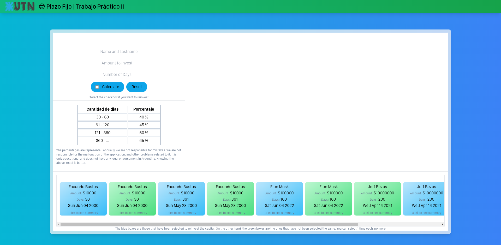
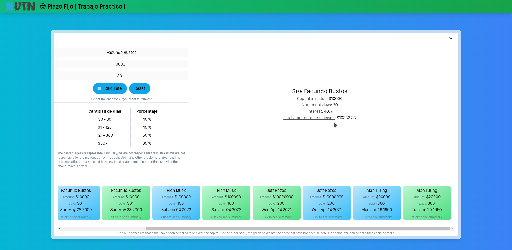
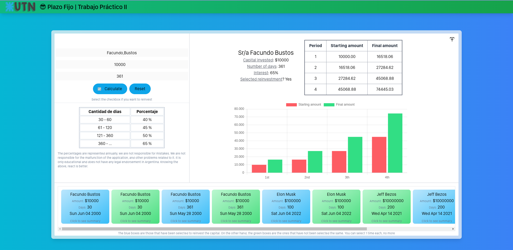
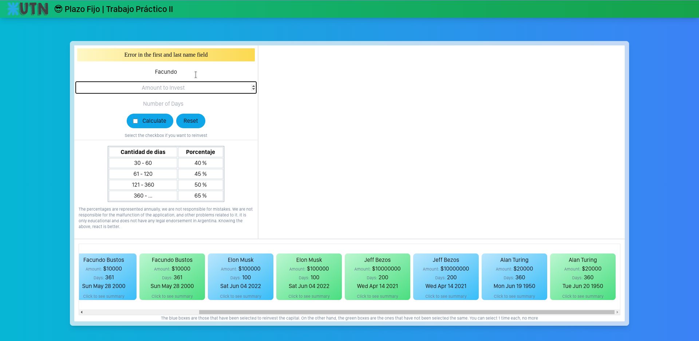

# Trabajo practico II - Laboratorio de Computación III
Este trabajo practico es la continuación del anterior en el cual a comparación se utiliza Vue.js junto con otras tecnologías.
## Simulador de plazo fijo

### Funcionamiento técnico requerido

El plazo fijo es una alternativa de inversión, en donde el ahorrista ingresa un monto de dinero, una cantidad de días, y al término de esos días recibe el monto inicial más intereses.

Deberá realizar un simulador de plazo fijo, en donde existan diferentes inputs donde se ingresará:
- Nombre y Apellido de la persona
- Monto a invertir
- Cantidad de días
- Si desea re invertir el capital.

Al apretar el botón “Calcular”, deberá verificar que:
El nombre y apellido no sean vacíos.
El monto a invertir sea un número, y como mínimo $1000
Que la cantidad de días sea un número, y como mínimo 30.

Si alguna de esas validaciones es inválida, mostrar un mensaje indicando cual es el error.

Si todos los datos son correctos, se tiene que agregar un texto (o similar) debajo en donde indique el monto final que recibir. Este es determinado por la siguiente fórmula:
- monto final = monto inicial + (monto inicial * (cantidad días / 360) * (porcentaje / 100))

El porcentaje está determinado por la cantidad de días que se invierte:

Cantidad de días Porcentaje:
- 30 - 60 = 40%
- 61 - 120 = 45%
- 121 - 360 = 50%
- 360 - = 65%

Por último, si el usuario selecciona la opción de “re invertir el capital”, se le deberá mostrar una tabla con lo que cobrará en los siguientes 4 períodos.

### Screenshot






***
### Tecnologías

Lista de tecnologías utilizadas en el proyecto:

* [Vite](https://vitejs.dev/): Versión 2.9.9
* [Vue js](https://vuejs.org/): Versión 3.2.25
* [Vue-Router](https://router.vuejs.org/): Versión 4
* [Vuex](https://vuex.vuejs.org/): Versión 4.0.2
* [Vue-Chartjs](https://vue-chartjs.org/): Versión 4.1.1
* [Chart js](https://vue-chartjs.org/): Versión 3.8.0
* [Axios](https://axios-http.com/docs/intro): Versión 0.27.2
* [Tailwind CSS](https://tailwindcss.com/): Versión 3.0.24
* [Post CSS](https://postcss.org/): Versión 8.4.14
* [Autoprefixer](https://github.com/postcss/autoprefixer): Versión 10.4.7

***
### Operatividad

Como instalar e inicializar el proyecto:
```
$ git clone https://github.com/FacuNBustos/TrabajoPractico2_plazoFijo-app.git
$ yarn install
$ yarn run dev
```